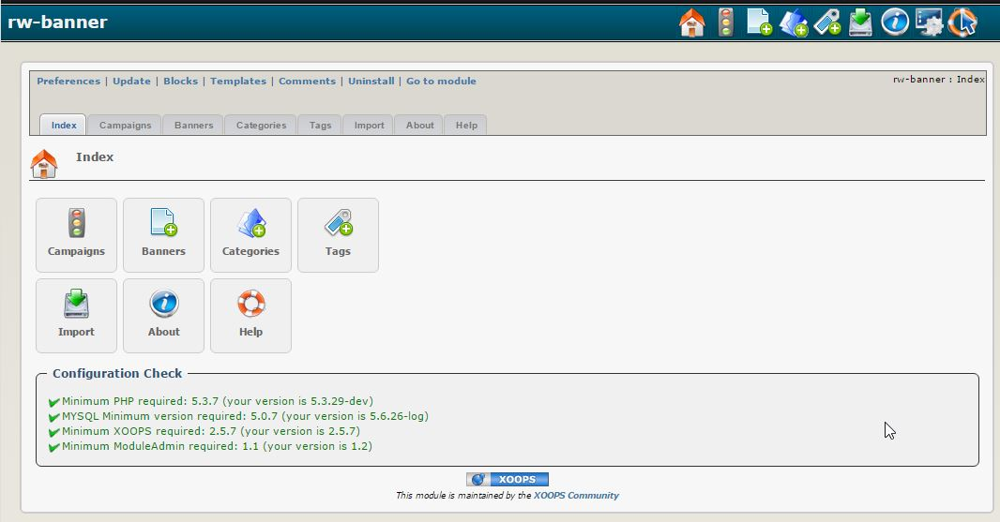

### _XOOPS Documentation Series_

# Module rwBanner
#### for XOOPS 2.5.7
      

            
## User Manual

© 2015 XOOPS Project ([www.xoops.org](http://xoops.org))    

## Module Purpose 

This module is for managing and showing random banners, that can be used or not together with the default XOOPS banner system.

*Figure 1: Main view of the rwBanner Module (Admin side)*

## Key Features

- Registering of banners separated by categories and clients. The categories are used to differnciate the size of the banners so that you can create several banner exhibition models. The clients are users registered at your site and when you add a banner you have to associate a banner with one of the registered users.

- 5 block models to show cloneable banners and with several configurations, allowing the administrator choose how many random banners he wants to show, which category should be shown and further, the option to create a table for the banner exhibition having only to select in how many columns they should be shown.

- Statistics block for the client. In this block is shown a table with the main statistics of all the banners related to the client.

- Activation and deactivation option of banners by one click. Only active banners will be shown but the inactive ones continue registered in the database, allowing you to reactivate them at any time.

- Beyond the banners exhibition blocks it is also possible to use the random banner in the theme of your site or in any other page you wish, having only to add the <{$rw_banner}> tag (this feature requires a small hack in the xops core that will be explained in the installation instructions below).

- Statistics page for the client. In the main page of the module is a table with all the statistics of the banners for the logged client. Further, in this page the client has the option to send the banner statistics for his registered e-mail.

- Showing or not random banners in the text of other modules. Now you can show your banners in any module that accepts bbcodes. You can publish banners in news, articles, static pages, including in any forum posts. (this feature requires a small hack in the xops core that will be explained in the installation instructions below).

# Table of Content

* [Install/Uninstall](book/1install.md)
* [Administration Menu](book/2administration.md)
* [Preferences](book/3preferences.md)
* [Operating Instructions](book/4operations.md)
* [The User Side](book/5userside.md)
* [Blocks](book/6blocks.md)
* [Templates](book/7templates.md)
* [Other](book/8other.md) //delete, if not used
* [Module Credits](book/9credits.md)
* 

##License:

 Unless specified, this content is licensed under a <a rel="license" href="http://creativecommons.org/licenses/by-nc-sa/4.0/">Creative Commons Attribution-NonCommercial-ShareAlike 4.0 International License</a>.

All derivative works are to be attributed to XOOPS Project ([www.xoops.org](http://xoops.org))
